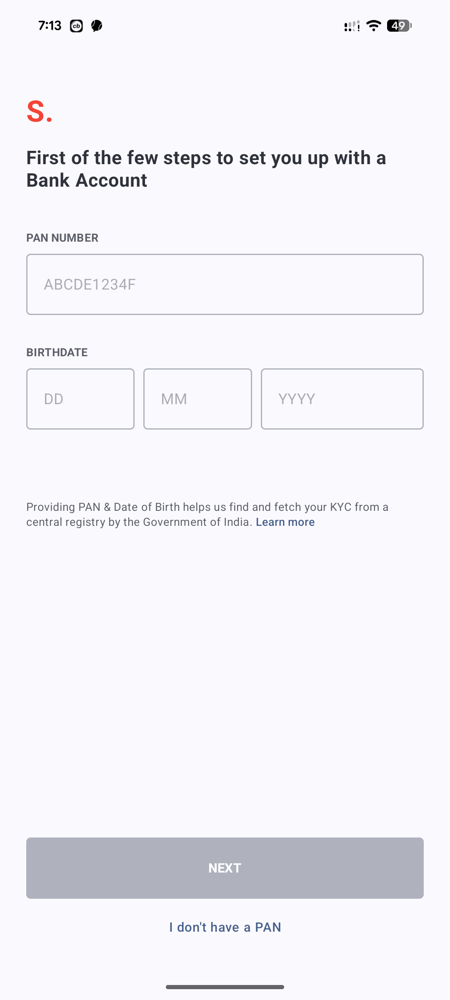
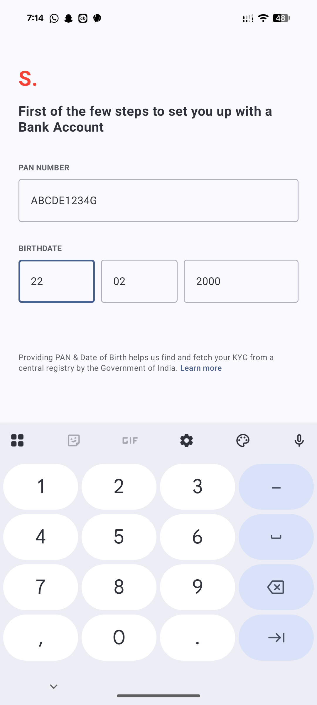
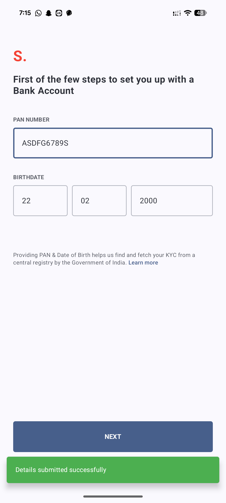
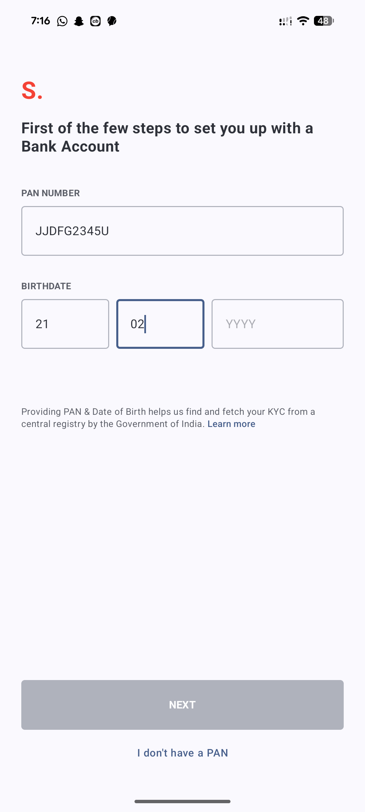
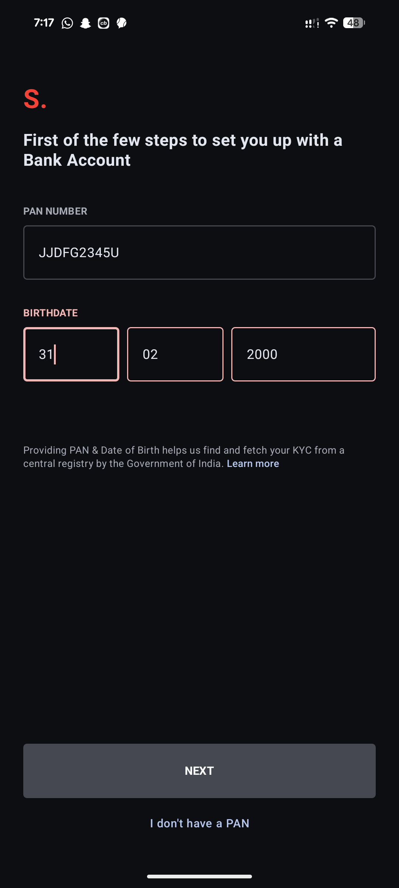

# Innovates - PAN Verification App

A modern Android application for PAN card and Birthdate verification, built with Jetpack Compose, following MVVM and Clean Architecture principles.

## Features
- **Strict PAN Validation**: Validates Indian PAN format (5 letters, 4 digits, 1 letter) with real-time feedback.
- **100% Accurate Birthdate Validation**: Handles leap years, specific month lengths, and prevents future dates using `java.time.LocalDate`.
- **Dynamic UI**: The "NEXT" button enables only when all inputs are valid.
- **Visual Error Indicators**: Fields turn red when logical validation fails (e.g., February 31st or invalid PAN format).
- **Modern UX**: Auto-focus progression between date fields and customized Green Snackbar for success messages.
- **Material Design 3**: Full support for Light and Dark themes.
- **Clean Architecture**: Decoupled Domain, Data (Validators), and UI layers for maximum testability.

## Tech Stack
- **Language**: Kotlin
- **UI Framework**: Jetpack Compose
- **Architecture**: MVVM + Clean Architecture
- **Dependency Injection**: Dagger Hilt
- **Navigation**: Jetpack Navigation Compose
- **State Management**: Kotlin Coroutines & StateFlow

## Screenshots

| Initial State | Valid PAN & Date | Success Message |
|---|---|---|
|  |  |  |

| Invalid PAN | Invalid Date | Year Incomplete | Dark Theme Error |
|---|---|---|---|
|  |  |  |  |

## How to Run
1. Clone the repository.
2. Open in Android Studio (Ladybug or newer recommended).
3. Sync Gradle and Run the `app` module.
